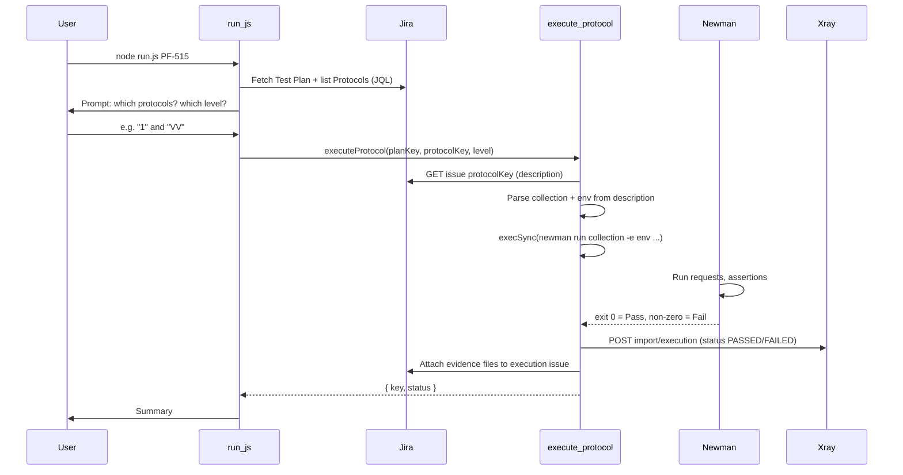

# What Happens Under the Hood: `run.js` and the Lily Demo

This is a reference you can use to answer questions during the demo. No code changes—just a walkthrough of the flow.

---

## 1. High-level flow



---

## 2. What `run.js` does (orchestration)

- **Validates** `.env` (Jira + Xray credentials) via `checkCredentials()`.
- **Fetches the Test Plan** from Jira (e.g. `PF-515`) and **lists Protocols** with JQL:  
  `project = "PF" AND issuetype = Test AND summary ~ "Protocol"`.
- **Prompts you**: which protocols (e.g. `1`, `1,3`, or `all`) and which **test level** (Dev, IV, VV).
- **Calls** `executeProtocol(testPlanKey, protocolKey, testLevel)` once per selected protocol.
- **Prints** a short summary (Passed / Failed / Error) per protocol.

Collection and environment are **not** chosen in the CLI. They come from the **protocol's Jira description** (see below). In the CLI you only choose **which protocol(s)** and **test level**.

---

## 3. What `execute-protocol.js` does (execution + Jira/Xray)

### 3.1 Protocol details from Jira

- **`getProtocol(protocolKey)`** fetches the Jira Test issue (e.g. `PF-516`) and parses its **description** (ADF → plain text).
- It uses regexes to find:
  - **Collection file:** `Collection File: ... (.postman_collection.json)`
  - **Environment file:** `Environment File: ... (.postman_environment.json)`
  - **Report base name:** from `reporter-html-export ... (.html)` or defaults to e.g. `PF_516`
- So: **one protocol in Jira = one collection + one environment**. In the demo you may have a single protocol (one collection, one env); with more protocols, each can point to a different collection and env.

### 3.2 File resolution

- Collection and env paths are resolved under `verification-automation/collections/` if the file exists there; otherwise the script uses the path as written.
- Output directory: `verification-automation/output/`.

### 3.3 Newman run (the function you asked about)

- **`execSync`** from Node's `child_process` is used (see [execute-protocol.js](execute-protocol.js) line 15 and 322).
- **Exact pattern:** run Newman as a **subprocess**; no programmatic Newman API—just a single CLI invocation.

Built command (conceptually):

```bash
npx newman run "<collectionPath>" -e "<envPath>" --insecure --ignore-redirects \
  --reporters cli,json,htmlextra \
  --reporter-json-export "<outputDir>/<reportName>.json" \
  --reporter-htmlextra-export "<outputDir>/<reportName>.html"
```

So:

- **Collection and env** are chosen by the **protocol** (from Jira description).
- Your **selection** in the CLI is which **protocol(s)** and which **level** (Dev/IV/VV). That level is stored in Jira/Xray metadata; it does not change which Postman collection or environment file is used.

### 3.4 Reporters we use

| Reporter    | Purpose | Output |
|------------|---------|--------|
| **cli**    | Terminal output | Printed to console; also written to `<reportName>_report.txt` in `output/` (not attached to Jira). |
| **json**   | Machine-readable results | `output/<reportName>.json` — **attached to Jira**. |
| **htmlextra** | HTML report | `output/<reportName>.html` — **attached to Jira**. |

So we use **three reporters**: `cli`, `json`, and `htmlextra`. Only the **json** and **htmlextra** exports are uploaded as evidence (plus the two metadata files below).

### 3.5 Evidence attached to the Test Execution

After the run, the script attaches **four** files to the created Test Execution issue in Jira:

1. **`newman_version.txt`** – output of `npx newman -v`
2. **`<reportName>.html`** – htmlextra report
3. **`<reportName>.json`** – json reporter export
4. **`run_metadata.json`** – test plan key, protocol key, level, git branch, commit SHA, Newman version, timestamp, collection/env names, **status** (Passed/Failed)

Attachment is via **Jira REST API**: `POST /rest/api/3/issue/{issueKey}/attachments` with a multipart file upload (see `attachFile()` in execute-protocol.js).

### 3.6 How we decide Passed vs Failed

- We **do not** parse the JSON report or call any extra API to decide.
- **Newman's process exit code** is used:
  - **Exit 0** → script sets `status = 'Passed'`.
  - **Non-zero** (e.g. assertion failure) → `execSync` throws → we catch, set `status = 'Failed'`, and still continue (create execution, attach evidence).
- That `status` is then:
  - Stored in `run_metadata.json`,
  - Sent to **Xray** as `PASSED` or `FAILED` in the execution import payload (`tests[].status`),
  - And written into the Test Execution's description in Jira.

So: **one process run, one exit code, one status**—no separate "API call" to determine pass/fail beyond running Newman.

### 3.7 Creating the Test Execution in Jira/Xray

- **Xray API** is used: `POST https://xray.cloud.getxray.app/api/v2/import/execution` (after authenticating with `XRAY_CLIENT_ID` / `XRAY_CLIENT_SECRET`).
- The payload includes: project, summary, description (with level, plan, protocol, git, Newman version, timestamp, **status**), `testPlanKey`, and `tests: [{ testKey: protocol.key, status: 'PASSED'|'FAILED', comment: ... }]`.
- Xray creates the Test Execution issue and links it to the Test Plan and protocol. The script then attaches the four evidence files to that issue via the Jira attachments API.

---

## 4. Quick demo answers

- **"What does run.js do?"**  
  It fetches the Test Plan and its Protocols from Jira, asks which protocols and level to run, then for each selected protocol runs Newman (collection + env from that protocol's Jira description), creates a Test Execution in Xray with Pass/Fail, and attaches evidence (Newman version, HTML report, JSON report, run metadata).

- **"How do we run Newman?"**  
  Via Node's `execSync`: we build a `newman run ...` CLI command and run it in a subprocess. Collection and environment paths come from the protocol's Jira description.

- **"Which collection/env?"**  
  Determined by the **protocol** you selected. Each Jira Test (protocol) has "Collection File" and "Environment File" in its description; we parse those and run that pair. In the demo there may be only one protocol (one collection, one env).

- **"What reporters?"**  
  **cli** (console + optional .txt file), **json** (export file attached to Jira), **htmlextra** (HTML export attached to Jira).

- **"How do we know pass or fail?"**  
  From Newman's **exit code**: 0 = Passed, non-zero = Failed. We don't parse the JSON or call another API for that.

- **"What do we upload to Jira?"**  
  The created Test Execution gets four attachments: Newman version, HTML report, JSON report, and run metadata (including status).

---

## 5. Files to point to in the demo

- **Orchestration:** [run.js](run.js) – prompts, calls `executeProtocol`.
- **Execution + Jira/Xray:** [execute-protocol.js](execute-protocol.js) – `getProtocol`, `execSync` (Newman), `createTestExecution` (Xray), `attachFile` (Jira), and where status is set from the exec result.
